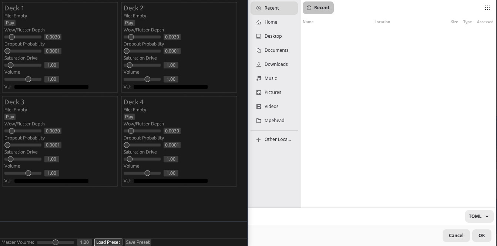

## Overview

Tapehead is a standalone GUI application built to emulate the characteristic audio behavior of analog cassette decks — including wow, flutter, and tape saturation — across a four-deck virtual interface. Designed for musicians and sound designers, the application allows users to drop in audio files, manipulate them live, and export the results as new stems or files. Rather than functioning as a full DAW plugin, Tapehead targets a narrower creative niche: fast, intuitive tape-style experimentation without the overhead of a complete production environment.

## Motivation

The project grew out of an interest in analog audio aesthetics and the technical challenge of modeling the physical imperfections that define the cassette deck sound. Tape artifacts like wow and flutter are deeply tied to the mechanical limitations of magnetic tape transport — capturing them convincingly in software requires careful study of both signal processing and the listening experience they produce. Tapehead is also an exercise in building expressive, real-time audio tooling with a GUI that feels immediate and hands-on, closer to working with hardware than launching a plugin session.

## Features

- Provides a four-deck interface for simultaneously loading, monitoring, and manipulating independent audio files.
- Emulates analog tape characteristics including wow, flutter, and tape saturation across active decks.
- Supports live, real-time parameter control through a graphical interface during active playback.
- Accepts audio files via drag-and-drop for quick session setup without manual file browsing.
- Records processed deck outputs directly as new stems or standalone audio files.
- Enables tape-echo chain construction for lo-fi delay effects inspired by classic dub production techniques.

## Implementation Notes

> _Implementation notes will be added as core architecture solidifies._

Tapehead is currently in an early design phase. The primary engineering focus is the tape emulation engine — specifically, modeling the time-varying pitch and amplitude instability of wow and flutter in a way that responds naturally to real-time parameter input. The four-deck architecture requires careful audio thread management to keep each deck's playback pipeline independent while keeping the GUI loop responsive. Export functionality will need to capture processed output cleanly across deck configurations without introducing latency artifacts into the recorded stems.

## Roadmap

- Core tape emulation engine (wow & flutter modeling)
- Four-deck GUI layout and deck management
- Real-time parameter control via GUI controls
- Audio file import via drag-and-drop
- Tape echo chain effects
- Stem and file export
Tapehead is envisioned as audio processing application that emulates the quirks of analog cassette decks, things like wow and flutter, while providing a interface with four virtual decks.

Users drop in audio files, manipulate them live via a GUI, and record outputs as new stems or files. The goal is a tool that’s intuitive for musicians and sound designers, blending nostalgic emulation with modern usability. It’s not a full DAW plugin but a standalone app for quick dub-style experiments, lo-fi effects, and tape-echo chains.

<!--  -->

---

## Features

- **Four Virtual Decks** — Load and manipulate up to four audio files simultaneously
- **Analog Tape Emulation** — Realistic wow, flutter, and tape saturation modeling
- **Live GUI Control** — Real-time parameter manipulation during playback
- **Stem & File Export** — Record outputs directly as new stems or audio files
- **Tape Echo Chains** — Build lo-fi delay and echo effects inspired by classic dub production

## Use Cases

- Lo-fi music production and sound design
- Dub-style mixing and experimentation
- Tape degradation and texture effects
- Quick audio mangling without a full DAW

## Roadmap

- [ ] Core tape emulation engine (wow & flutter)
- [ ] Four-deck GUI
- [ ] Real-time parameter control
- [ ] Audio file import (drag & drop)
- [ ] Stem/file export
- [ ] Tape echo chain effects

